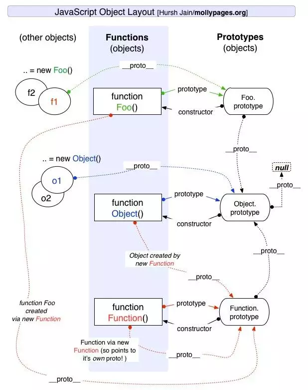

# JS原型链什么鬼


## 前言

原型链是js中比较困扰人的一个问题，现在我们来探究这个到底是什么鬼

## 问题起源

我们都知道，javascript是面向对象语言。javascript里面的一切变量均为对象。javascript的函数也可以看做是一种特殊的对象。而在javascript当中，函数是一等公民，函数可以被调用。

先看几个经常看到但是不是特别理解的东西：

- `prototype`
- `__proto__`
- `constructor`
- `instanceof`
- `new`

问题出自于下面几个简单的表达式：

- `Object instanceof Object // true`
- `Function instanceof Object // true ???`
- `Object instanceof Function // true ???`
- `Function instanceof Function // true ???`
- `Function.prototype instanceof Object // true`
- `Function.prototype instanceof Function // ture ???`
- `Object.__proto__.__proto__.constructor == Object // true ???`
- `Function.constructor === Function // true ???`

## \_\_proto\_\_

\_\_proto\_\_ 不是一个标准，但是绝大多数的浏览器都实现了他。\_\_proto\_\_ 是真正标识原型链的对象。

!!! warning "注意"
    ES中标准的\_\_proto\_\_定义为[[proto]]，可以看到很多文档写法上会使用标准[[proto]]，本文我们直接使用\_\_proto\_\_

```js hl_lines="2"
var obj = {}
obj.__proto__ == Object.prototype  // true, why ??
```

## prototype

不是所有对象都具有`prototype`属性，只有`函数`才有`prototype`属性，因为函数通过“构造调用”的方法创建出对象。

明确一点就是，函数的`prototype`属性是一个对象，这个对象默认包含一个`constructor`的属性，这个属性也是一个对象，指向函数本身。

## constructor

当一个函数被以“构造调用”的方式执行时候，这个函数就称为`constructor`

Example:
```js
var Person = function () {
  this.name = 'yejiaqi' // 思考此函数如果带有参数，或者带有返回值会有什么结果？
}

var p1 = new Person()  // new Person 带括号和不带括号有什么区别？
console.log(p1.name)  // "yejiaqi", Person 为 constructor

```

## constructor, prototype, \_\_proto\_\_基本关系

\_\_proto\_\_ 和 prototype 是js原型链和原型继承的基础。两者的单词都含有proto（原型的语义），很容易让人混淆。

### 关系解释

```js
var Person = function () {
  this.name = 'yejiaqi' // 思考此函数如果带有参数，或者带有返回值会有什么结果？
}

console.log(Person.prototype)  // {constructor: ƒ}
console.log(Person.prototype.constructor === Person)  // true, constructor执行函数本身

p1 = new Person()

console.log(p1.__proto__ == Person.prototype)  // true, 实例对象的__proto__指向constructor的prototype
```

### 对象属性查找

```js
var Person = function () {
  this.name = 'yejiaqi'
}

p1 = new Person()

console.log(p1.secret)  // undefined

Person.prototype.secret = 'secret'

console.log(p1.secret)  // secret

console.log(p1.hasOwnProperty('name'))  // true
console.log(p1.hasOwnProperty('secret'))  // false

console.log(p1.secret === Person.prototype.secret) // true

p1.secret = 'no secret'

console.log(p1.secret)  // "no secret"，复写

console.log(p1.secret === Person.prototype.secret) // false
console.log(p1.hasOwnProperty('secret'))  // true
```

可以将javascript的属性查找理解为以下函数

```js
function getAttr(obj, attr) {
  if (obj === null) {
    return undefined
  }
  if (obj.hasOwnProperty(attr)) {
    return obj[attr]
  } else {
    return getAttr(obj.__proto__, attr)
  }
}

getAttr(p1, 'secret')  // "secret"

getAttr(p1, 'name')  // "yejiaqi"

getAttr(p1, 'xxx')  // undefined

```

大家请看下列示例,示例企图用对象来做哈希表统计一段字符串各个单词出现的频率

```javascript

var str =  `javascript is a programming language for web. 
Nowadays, javascript can also be used as a server side language using nodejs. 
In javascript prototype and constructor are key concepts, you should know it well`

var strArr = str.split(' ')

var summary = {}

for (let word of strArr) {
  if (summary[word]) {
    summary[word] += 1
  } else {
    summary[word] = 1
  }
}

console.log(summary)

```

看起来毫无毛病，但是真正执行起来的时候，你会看到除了一个单词，其他都正常，这个单词就是`constructor`
```
constructor:"function Object() { [native code] }1"
```

原因就是`summary['constructor']`这个会去原型链进行属性寻找，最终找到了`summary.__proto__.constructor`，也就是`f Object() [native code]`

### 对象方法

对象的方法可以看做是对象一类特殊的属性，此处定义时需要注意的是`this`的指向问题

```js
var Person = function () {
  this.name = 'yejiaqi'
}

Person.prototype.sayName = function () {
  return 'My name is ' + this.name
}

var p1 = Person()
var p2 = Person()
p2.name = 'yejiaqi2.0'

console.log(p1.sayName())
console.log(p2.sayName())

```

### new过程进行的操作

运算符`new`会执行构造函数`constructor`，并且把`this`绑定到一个新创建的对象，并且这个对象`__proto__`执行`constructor`的`prototype`

可以用以下过程来理解

```javascript 
function fakeNew(constructor, args) {
  // 创建对象，并且设置对象的__proto__为constructor.prototype，相当于
  // var newInstance = {}
  // newInstance.__proto__ = constructor.prototype
  var newInstance = Object.create(constructor.prototype)

  // 调用构造函数，绑定this到newInstance
  var result = constructor.apply(newInstance, args)

  // 如果调用函数的返回值是一个非null对象，返回这个对象
  // 否则返回newInstance
  // 构造完毕
  return result && typeof result === 'object' ? result : newInstance
}


```

## 原型链

我们发现`constructor`的`prototype`也是一个对象，对象就可以拥有`__proto__`属性,`__proto__`属性就能指向创建他的`constructor`的`prototyope`。也就是说可以通过这样的循环，创造出一条链。非常绕，我们看一个例子

```javascript
var Person = function () {
  this.name = 'yejiaqi'
}

Person.prototype.sayName = function () {
  return 'My name is ' + this.name
}

var Man = function () {
  this.gender = 'male'
}

// 注意此处
Man.prototype = new Person()  // prototype chain !
Man.prototype.contructor = Man  // 注意此处

var m1 = new Man()

console.log(m1.name)
console.log(m1.gender)

```

上述的Man实例的原型链：

```javascript
m1.__proto__  // Man.prototype, Person 的实例
m1.__proto__.__proto__ // Person.prototype
m1.__proto__.__proto__.__proto  // Object.prototype
m1.__proto__.__proto__.__proto.__proto__  // null
```

注意这样的操作

```javascript
var Person = function () {
  this.name = 'yejiaqi'
}

Person.prototype.sayName = function () {
  return 'My name is ' + this.name
}

var Man = function () {
  this.gender = 'male'
}

Man.prototype = new Person()  // prototype chain !
Man.prototype.contructor = Man

var m1 = new Man

// 此时操作 Person 的 prototype
Man.prototype = {'__proto__': Man}  // 这个操作相当于更换引用，原来m1的__proto__ 并不会更新

console.log(m1.__proto__ === Man.prototype)  // false !!!

```

!!! summary "关键点总结"
    - `constructor`是函数
    - `__proto__`和`prototype`是对象
    - 只有函数有`prototype`属性
    - 实例对象缺属性，去`__proto__`寻找
    - 实例对象的`__proto__`指向`constructor`的`prototype`
    - `constructor.prototype.constructor`反向指回`constructor`
    - `consturctor.prototype`也是对象，也可以拥有`__proto__`
    - 最新形成了`__proto__`链
    - null 是原型链的结束，Object.prototype是原型链的顶端

## 深入原型链



**现在我们对原型链有了充分的理解，可以尝试解释一开始提出的问题**

### instanceof 的逻辑

实际上是校验原型链

```javascript
var Person = function () {}
var Man = function () {}

Man.prototype = new Person
Man.prototype.constructor = Man

var SuperMan = function () {}
SuperMan.prototype = new Man()
SuperMan.prototype.constructor = SuperMan

var tiga = new SuperMan()

tiga instanceof SuperMan // true, tiga.__proto__ == SuperMan.prototype
tiga instanceof Man // true, tiga.__proto__.__proto__ == Man.prototype
tiga instanceof Person // true, tiga.__proto__.__proto__.__proto__ == Person.prototype

// 变换prototype
SuperMan.prototype = {}

tiga instanceof SuperMan // false, tiga.__proto__ != SuperMan.prototype
tiga instanceof Man // true, tiga.__proto__.__proto__ == Man.prototype
tiga instanceof Person // true, tiga.__proto__.__proto__.__proto__ == Person.prototype

```

### 解释问题

```javascript
Object instanceof Object  // true, Object.__proto__.__proto__ == Object.prototype
Function instanceof Object // true, Function.__proto__.__proto__ == Object.prototype
Object instanceof Function // true, Object.__proto__ == Function.prototype
Function instanceof Function // true, Function.__proto__ == Function.prototype
Function.prototype instanceof Object // true, Function.__proto__.__proto__ == Object.prototype

Object.__proto__.__proto__.constructor == Object // true
Function.constructor === Function // true, 对象查找，Function.__proto__.constructor == Function

```

### javascript顶层原型链设计哲学

在上图中分析我们可以的到

```js
function Foo() {}
Foo.__proto__ == Function.prototype // Foo 是Function的实例

Function.__proto__ == Function.prototype  // 可以认为Function就是Function的实例

Object.__proto__  == Function.prototype // 可以认为Object也是Fun传统的实例

```

这就是鸡和蛋问题的产生的根本原因。最绕的地方在于这里原型链的相互引用

我们找出直接的原型链，按照`__proto__`

```
Function -> Function.prototype -> Object.prototype -> null
Object -> Function.prototype -> Object.prototype -> null
```

我们可以发现，链的关键在于一个对象，那就是`Function.prototype`

在console中我们输入Function.prototype可以发现：

- Function.prototype是native code的，也就是浏览器特殊实现的，并不是纯javascript实现的
- Function.prototype可以被调用，并且永远返回undefined，非常神奇
- `Function.prototype instanceof Function`是false（思考为什么），`typeof Function`是`function`

另外还可以发现`Object`：

- Object本身是个（构造）函数，是Function的实例，即`Object.__proto__`就是`Function.prototype`
- `Object.prototype`是对象吗？是的，js中对象的定义就是属性的集合，`Object.prototype`是对象，但是他不是`Object`的实例

总结：鸡蛋问题

**先有Object.prototype（原型链顶端），Function.prototype继承Object.prototype而产生，最后，Function和Object和其它构造函数继承Function.prototype而产生**

## Further Reading

- [MDN Object.prototype](https://developer.mozilla.org/en-US/docs/Web/JavaScript/Reference/Global_Objects/Object/prototype)
- [MDN Function.prototype](https://developer.mozilla.org/en-US/docs/Web/JavaScript/Reference/Global_Objects/Function/prototype)
- [MDN javascript prototype chain](https://developer.mozilla.org/en-US/docs/Web/JavaScript/Inheritance_and_the_prototype_chain)
- [Class Checking instanceof](https://javascript.info/instanceof)
- [Github \_\_proto\_\_ and prototype](https://github.com/creeperyang/blog/issues/9)