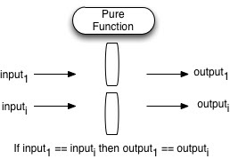

# Pure Function

## 函数的三大作用

1. mapping: 映射，从输入计算得到输出的函数。
2. procedure: 处理过程，一系列的处理过程组织成一个函数。这样的编程方式经常被称为面向过程编程。
3. IO: 用户输入输出，系统间交互，磁盘读写，网络请求等


## Mapping

对于pure function，最主要讲的是mapping。含义是，对于pure function，所有的输入都分别对应一个输出，函数会处理输入，返回一个对应的赎回粗。

在代数中，mapping指的就是将集合A映射到集合B。最典型的mapping就是代数中的函数，如

```
f(x, y) = x + y
```

在JavaScript中，相似的：

```js
const add = (x, y) => x + y
```


## pure function

purefunction 的定义是，满足以下条件的函数：

- 无论执行多少次，相同的输入都会产生相同的输出
- 不产生副作用(side effect)

反向：如果使用一个函数时候，不使用他的返回值，但是确有某些意义的话，说明这个函数是非纯函数。



建议在任何可以使用pure function的地方使用它。因为他是简单的、最容易复用的代码块。在CS中，最符合KISS的原则（Keep It Simple, Stupid）。pure function有很多有利的性质，且构造了 函数式编程(functional programming) 的基础。pure function是和外界的状态完全隔离的，这避免很多由于依赖外部状态导致的bug。这样的特性，同时成就了他们能够很好地胜任并行计算，无论是GPU并行计算、还是说在整个分布式系统中。

同时pure function很容易维护、重构、组织代码，让程序变得更加灵活、对变化的适应性更强

关键点：

- avoid shared state (避免共享状态，共享状态的函数非纯)
- random numbers generate (随机数生成，导致函数非纯)
- IO函数 本文不讨论
-  no side effect or mutation 无副作用和修改
pure function中，相同的输入永远会得到相同的输出。

```js
Math.random() // not pure
const time = () => return new Date() // not pure
const compare = (x, y) => return x < y // pure
```


## 共享状态的问题

在JavaScript中，假设函数

```js
var state = 1

function f () {
    state = state * 2
    return state
}

function pure (state) {
	return state * 2
}

// use
f()
state = pure(state)
```

以上的f函数就是，即使不使用f的返回值，f的运行也是有意义的。但是pure则不同，不使用pure的返回值，则pure执行是无意义的。问题在于f和外部存在“共享状态”，当外部作用域的变量被多个使用的时候，共享就会存在很大的问题。

假设我们的函数存在异步操作，那么就会存在另外一个问题，竞争条件。

!!! note "竞争条件"
    竞争条件的含义，程序执行的结果取决于调度的顺序，这种现象称之为竞争条件

考虑以下JavaScript代码

```js

var state = 1;

function f1 () {
    return new Promise((resolve, reject) => {
		state = state * 2
		timeout(() => {
			reslove(state)
		}, 1001)
	})
}

function f2 () {
	    return new Promise((resolve, reject) => {
		state = state * 2
		timeout(() => {
			reslove(state)
		}, 1000)
	})
}

f1()
f2()
```

在这里你会发现，管理state这个变量的状态，会变得非常复杂。有同学说理解了JavaScript的异步队列，timeout也能知道先后执行顺序。但是这样的了解并不应该用在工程化实现上来，无疑这两处产生的竞争条件会大大影响代码的可维护性。这意味着，程序的不确定性，输出的结果是不可预计或者是难以预计的，这导致难以测和难以被理解。

## 不可对参数进行修改

我们知道，在JavaScript中，传入函数的参数都是传递引用的。这意味着，我们可以在函数中对参数的值进行修改，从而修改调用时候传入的值。

```js
// not pure
const push = (arr, x) => {
	arr.push(x)
}
```

在上述例子中，push函数调用时候，修改了arr的值，使得整个函数不是pure的。

此处的问题在于，整个函数对arr进行了修改，实质上arr可能还会用于其他的函数之中。这里就存在了隐式的状态变化，维护这份代码的时候必须心里非常清楚整个函数做了这样的操作，在改变涉及arr参数的函数的调用顺序时候，也要考虑这个问题。对于代码重构来说，可能会导致出现很多意想不到的bug。

换一种方式

```js
// pure
const push = (arr, x) => {
	let newArr = lodash.cloneDeep(arr)
	newArr.push(x)
	return newArr
} 
```

在这个例子里面，我们调用lodash的cloneDeep方法对数组进行深复制，然后再进行push操作，最后返回新的数组。使得这个函数的运行和app整体的state是无关的、独立的。

有同学会问，深复制会导致性能的消耗。这个是肯定会的，但是此处我们讨论的层次是系统状态的关联，不是性能层面的。

**值得注意的是，我们经常使用的lodash中，有的函数是不带副作用的，但是有些函数确实带副作用的，需要认真阅读文档。在使用在这样是存在差异的。**


## pure function 应用

**不是所有的函数需要时pure，有的函数也不应该成为纯函数。纯函数和非纯函数可以和谐的共处**

- react rudux 状态管理：相同序列操作传入reducer中，永远产生相同效果，这取决于pure function。如果reducer中不使用pure function，就会产生不可控制的状态，在无形中增加了很大的维护成本，导致业务难以维护，当业务越来越庞大时候，最终走向重构。
- 可测试性和可维护性。因为相同的输入永远会产生相同的输出，对测试来说是很非常好的。如果在正确的地方使用pure function，可以有效的增加代码的质量。


## Links

- [pure function](https://medium.com/javascript-scene/master-the-javascript-interview-what-is-a-pure-function-d1c076bec976)
- [wikipedia pure function](https://en.wikipedia.org/wiki/Pure_function)
- [prevent verus impure function](https://toddmotto.com/pure-versus-impure-functions)
