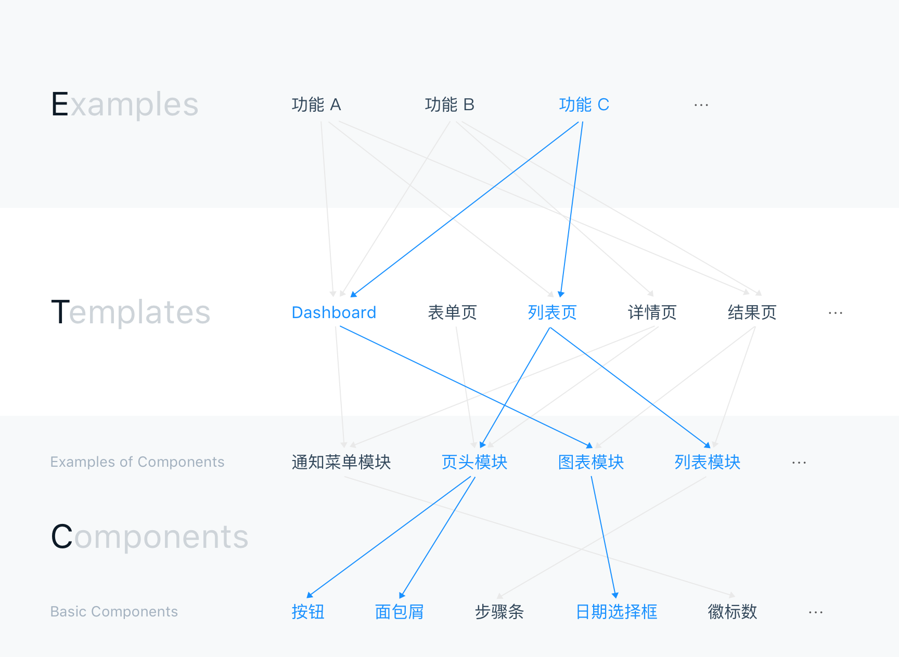
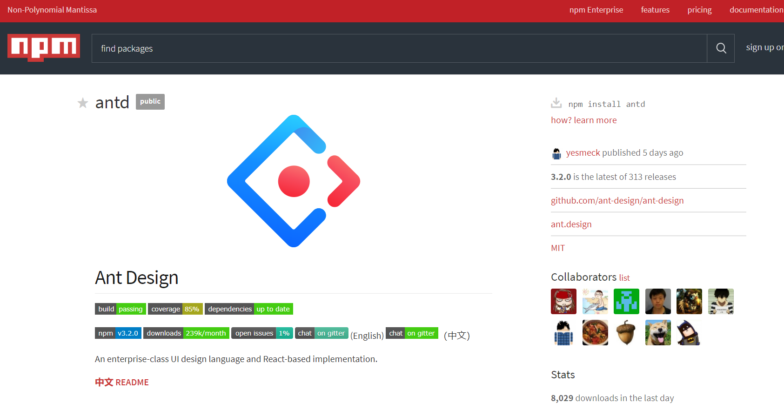
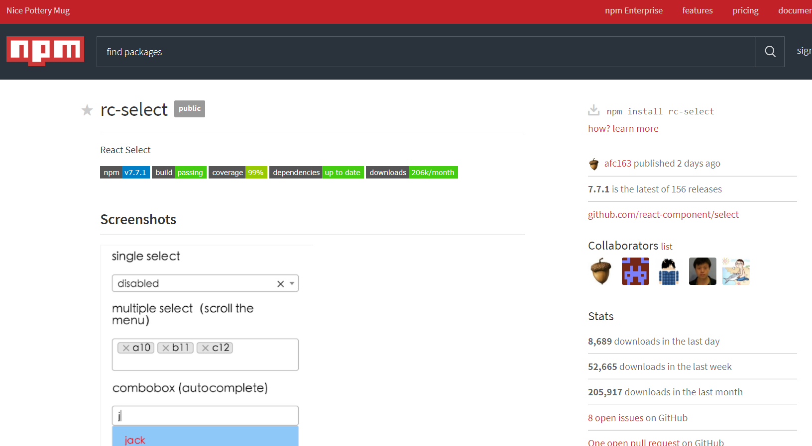
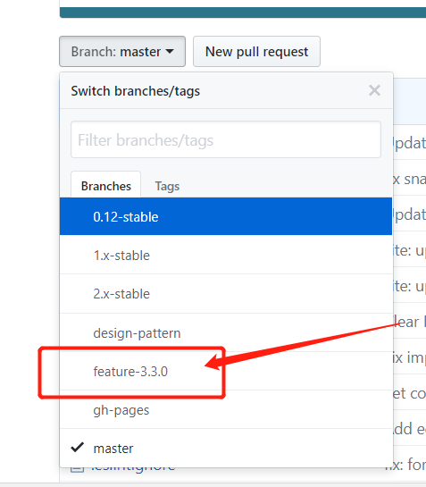
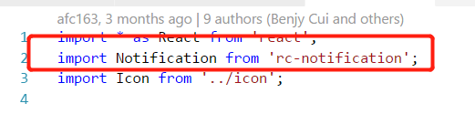
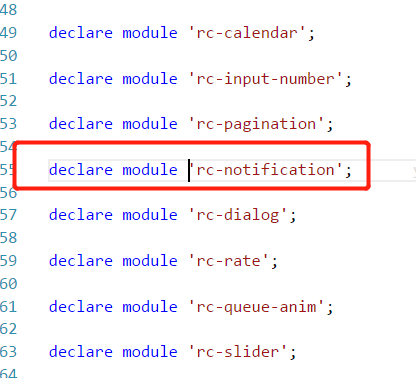
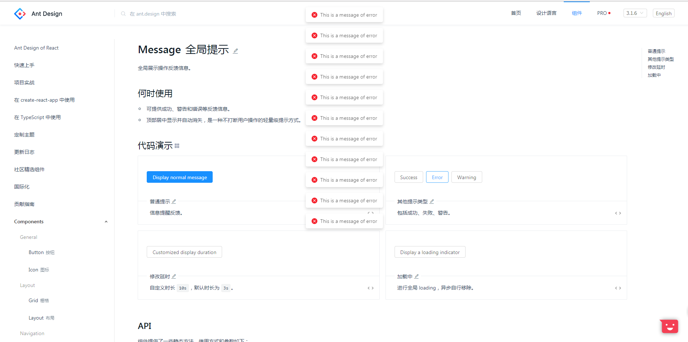
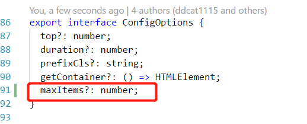
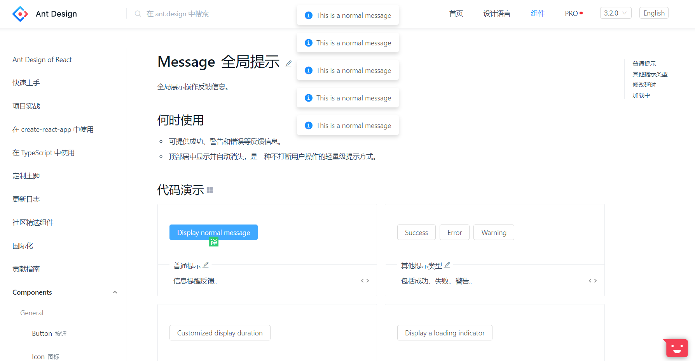
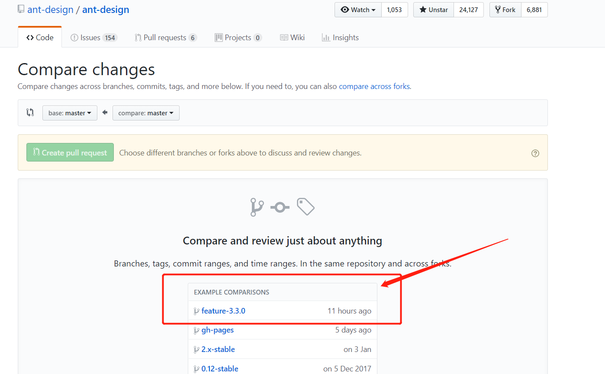

# antd组件管理调研


## 组件结构

### 分层管理



### 组件代码分布

- antd组件仓库，antd官网的仓库 https://github.com/ant-design/ant-design
- 基础组件仓库，存放在react-componets这个organization下，且每个组件一个仓库 https://github.com/react-component
- template、example这些也是放在antd的仓库的
- cli脚手架，存在一个叫做rc-tools的仓库，用于组件开发时候的工具（编译、发布、构建等）

### 组件发行

- 在npm上管理，antd：https://www.npmjs.com/package/antd
- 基础组件也在npm上管理，https://www.npmjs.com/package/rc-select
- 引入组件直接在package.json中指定依赖即可
- 发布组件时候，修改package.json的version，然后执行npm publish即可，当然是需要仓库管理权限才行






## 版本管理

- 修订版本号：每周末会进行日常 bugfix 更新。（如果有紧急的 bugfix，则任何时候都可发布）
- 次版本号：每月发布一个带有新特性的向下兼容的版本。
- 主版本号：含有破坏性更新和新特性，不在发布周期内。

目前的feature应该是3.3版本



## issues管理

### 提issue工具

他们专门开发了一个issue的助手，其实就是一个web接口。

http://new-issue.ant.design/

### 小单

使用 good first issues 来标记，就是比较好实现的单

### issue 追踪

如果你想要对antd提出新的feature或者bug，这时候，antd建议在仓库中提一个issue，描述feature或者bug。


最终antd的web接口会调用github的open api，将issue记录到仓库


**接下来我们尝试编写代码完成这个需求**

## 开发流程


### fork

由于是开源代码开发，所以需要先fork一份到自己的仓库。

### 打开antd开发环境

1. clone antd的源代码

	```
	git clone https://github.com/ant-design/ant-design.git
	```

2. 安装依赖，如果用外国源会非常慢。。建议用cnpm
	```
	npm install
	```

3. 运行antd开发环境
	```
	npm start
	```
	经过一轮webpack编译之后，会自动在本地打开一个和antd一样的web页面

## 打开react-componets开发环境

假设我们需要开发antd的message组件（类似于dev-notify），那么我们还需要到react-component的organization下找rc-notification这个组件。因为在antd这里引用了这个组件。

import了rc-notification组件：



看到这里有显示的type script module声明




1. clone rc-notification的源代码

	```
	git clone https://github.com/react-component/notification.git
	```

2. 安装依赖，如果用外国源会非常慢。。建议用cnpm
	```
	npm install
	```

3. 运行antd开发环境
	```
	npm start
	```
	经过一轮webpack编译之后，会自动在本地打开一个rc-component的开发页面

### 编写代码



我们使得组件可以配置，使得这些message只能显示一次。

我们现在修改代码，提供一个maxItems的参数，表示最多可以存在多少个消息框。



让多过maxItems的message自动马上调用消失函数



### 编写测试

测试是用jest做的

```js
it('at most maxitems message boxes', () => {
	message.config({
		maxItems: 5
	});
	for (let i = 0; i < 20; i++) {
		message.info('test')
	}
	expect(document.query(.ant-message-notice).length).toBeLessThanOrEqual(5)
})
```

执行单元测试

### 提交代码

**如果对rect-componet库进行了修改，那么也需要向react-component提PR**

> 由于 antd 的大部分组件都是基于 react-component 的，所以有时候你可能需要给相应的 react-component 仓库发送 pull request。如果你是修复了某个 bug，那么我们在合并你的修改后会尽快发布一个 patch 版本，然后你只要重新安装你的依赖就可以使用新发布的版本了。如果你的 pull request 是新增了某个功能，那么在你的修改合并并且发布版本后，你还需要发送一个 pull request 到 Ant Design 来升级相应的依赖、文档以及 TypeScript 的类型定义。

```shell
npm run lint # 检查代码风格.
git add . && git commit ... && git push ...
```

发PR到原仓库的对应分支，目前是feature-3.3.0分支




### antd核心成员review

antd核心成员对代码进行严格的review，然后

- 打回，给出reject的原因
- merge，合并到最新分支，等待下个版本发布

并且对应的rc组件会由antd核心成员push到npm上。rc组件的更新只需要重新编写依赖（package.json）的版本即可。